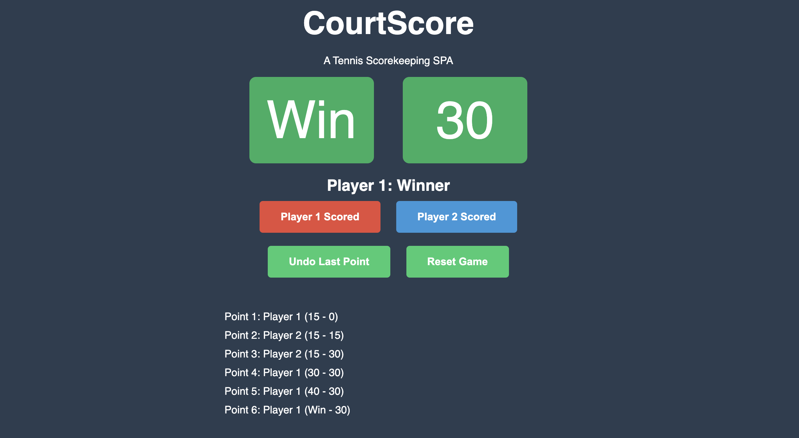

# CourtScore

CourtScore is a Tennis Scorekeeping Single Page Application (SPA) that helps keep track of the scores in a Tennis game.

## Table of Contents
- [Installation](#installation)
- [Usage](#usage)
- [Features](#features)
- [About the Author](#about-the-author)

## Installation
To run the application, simply visit the project website: https://legertom.github.io/CourtScore

## Features
- The game follows the standard Tennis scoring system.
- The game includes the Deuce system for games tied at 40 points.
- The application keeps track of the points history, displayed as a list.
- There is a function to undo the last point.
- The game can be reset.
- The application is responsive and works on all screen sizes.

## Usage
To keep track of the scores in a Tennis game, simply click on the "Player 1 Scored" or "Player 2 Scored" button to update the score. The application will automatically switch to the Deuce system when both players reach 40 points. To undo the last point, click the "Undo Last Point" button. To reset the game, click the "Reset Game" button.

## About the Author
This project was created by [Tom Léger](https://github.com/legertom). You can find the Github Repo for this project [here](https://github.com/legertom/CourtScore).
